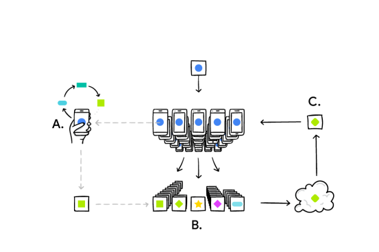
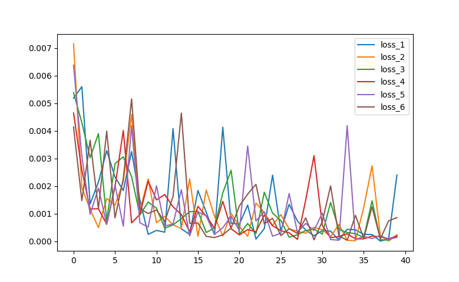

## Project Description -

### Federated Learning -

Federated Learning is paradigm that covers the decentralized learning of the model on the different devices and combine all the model parameters to make a global model. Federated learning was introduced by google back in 2017 that was used on google keyboard application to make the text prediction much more effective across multiple devices without transferring the typing data from the device.

### The Experiment - 

In this program I have implement 6 workers (virtual devices) that take the MNIST data and train on 10000 data points one each. The Global model is made using the Fed-Avg Algo that is used for the aggregation of the parameters.  

### Algo description - 

1. Since the parameters of the main model and parameters of all local models in  the nodes are randomly initialized, all these parameters will be  different from each other. For this reason, the main model sends its  parameters to the nodes before the training of local models in the nodes begins.

2. Nodes start to train their local models over their own data by using these parameters.

3. Each node updates its parameters while training its own model. After the  training process is completed, each node sends its parameters to the  main model.

4. The main model takes the average of these parameters and sets them as its  new weight parameters and passes them back to the nodes for the next  iteration.

   

   ### Illustration 

   

### Training 

### Results - 

- Graph to showing accuracy of the 6 worker models in test set. 

- Loss vs the number of epochs in the MNIST data set. ( Y axis - loss , X axis - number of epochs)

### Note - 

- Files - 
  - federated_toy_model2.py ( the file with 6 workers)
  - federated_toy_model2.py  ( the file with 2 workers)
  - workers.py (the file has the worker class)
  - models.py (the file has all the models)
